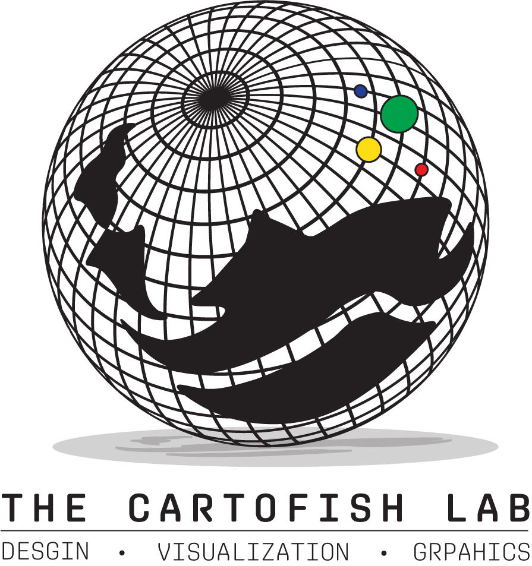

## Hi, I'm Kyle!
I'm a geography student at the University of Oregon focusing on spatial analysis, cartography, and data visualizations. By combining mapping software, GIS tools, and design principles I strive to create visually compelling maps. 

On this site, you'll find:
- A little bit of information about me.

- Maps and graphics I've done for classes or in my free time experimenting with data and designs.

---
## Education
- **B.S. in Geography (in progress)**
  - **University of Oregon** - Eugene, OR
- **A.A. in Geography**
  - **Cerritos College** - Cerritos, CA

---
## Maps
### Everyone Wants a Piece of Djibouti, Winter 2025

### Portland Street Map, Winter 2025

### Dr.Fish's Roadtrip Map, Winter 2025

### CartoFish Lab Logo Experimental Designs, Winter 2025

---
## Work History
- **Cerritos Center for Performing Arts** - Cerritos, CA
- **Harkins Theaters** - Cerritos, CA
- **Artune Jewlers** - Select Costco Locations

---
## Say Hi!
kyleimarcelino@gmail.com
